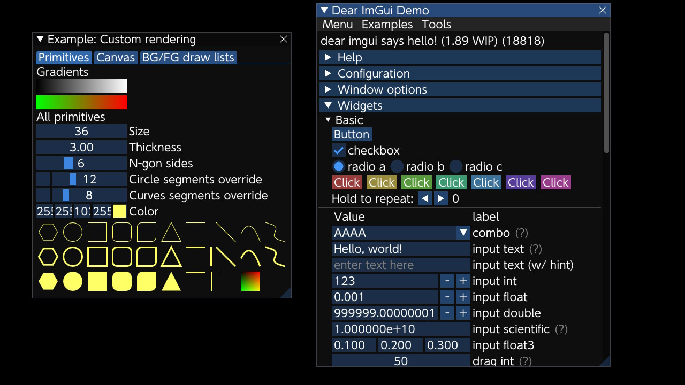

# imgui_deko3d_example

A [IMGUI](https://github.com/ocornut/imgui) template project with [deko3d](https://github.com/devkitPro/deko3d) backend for Switch homebrew.

Featuring:
- Clean and IMGUI style backend code.
- Compatible with latest IMGUI version.
- CMake support.

## screenshot

## compiling

Just use docker from [devkitpro/devkita64](https://hub.docker.com/r/devkitpro/devkita64).

## credits

[switchbrew/switch-examples](https://github.com/switchbrew/switch-examples) for how to use deko3d.
[mtheall/ftpd](https://raw.githubusercontent.com/mtheall/ftpd) and [averne/Turips](https://github.com/averne/Turnips) for their backends.
